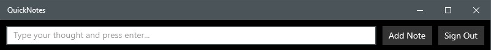

QuickNotes is an app for saving notes/ideas/thoughts to OneNote as quickly as possible on a Windows 10 PC:

It is a C# UWP project that allows the user to very quickly type in some text into the entry box and press enter (or tap the "Add Note" button) to have it saved to OneNote as a new page in a section titled "Quick Notes".

It is designed to be pinned to the Windows 10 taskbar and used completely via the keyboard.  Assuming that QuickNotes is pinned in the first position of the taskbar, simply use the following keyboard controls to add a note:

1. Press the Windows Key + 1 (or whichever number position QuickNotes is pinned to on the taskbar)
2. Type out your note (eg "remember to get the milk")
3. Press enter

That's it!  If you now switch to OneNote, you'll find the note added to your Quick Notes section.  You may need to force OneNote to sync the notebook, or simply just wait until OneNote syncs the Quick Notes section in due course.